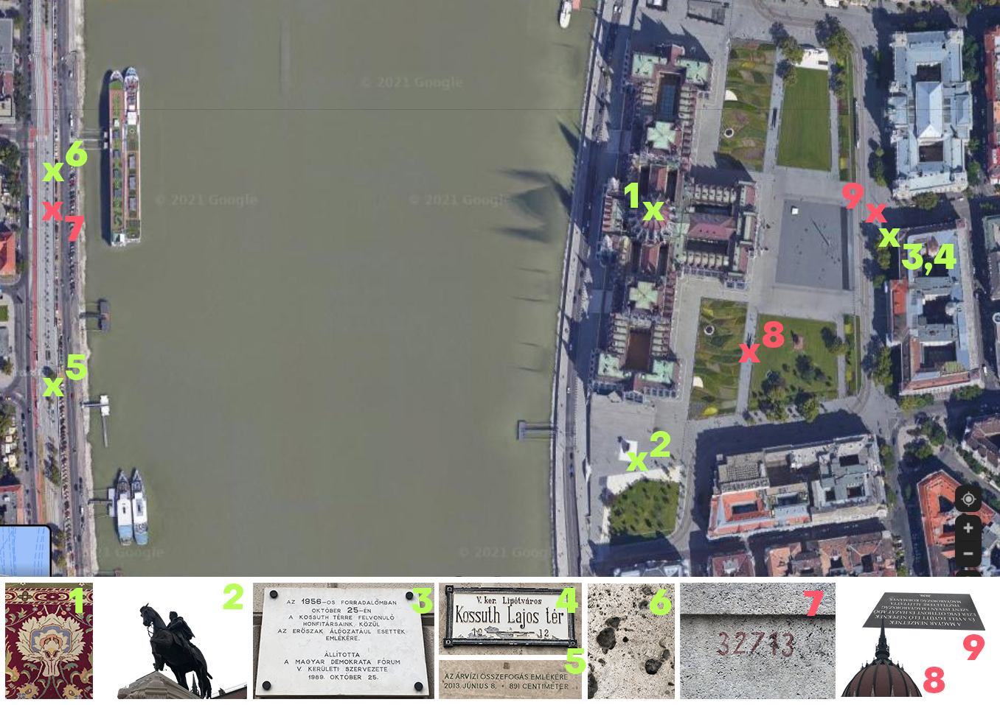
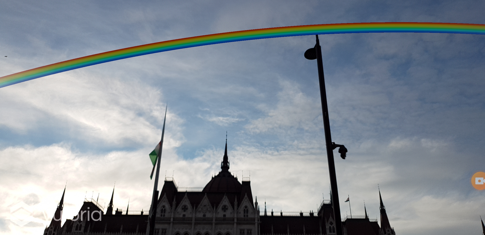
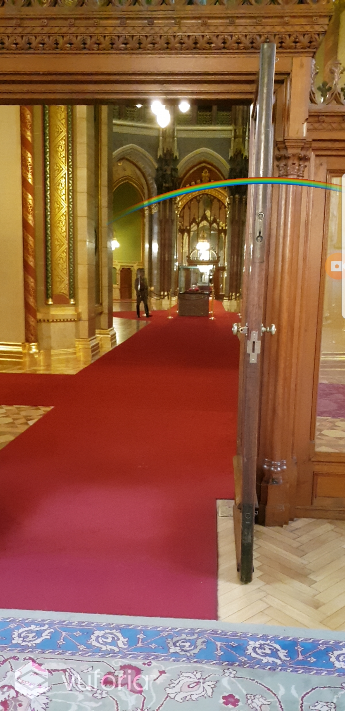

# ARainbow- szivÁRvány

## Abstract
### What was the whole project about, what did you archive...
I wanted to put an augmented reality rainbow in the Hungarian Parliament, because I don't agree with how the government is treating LMBTQ people's rights.

## Concept
### Motivation, idea, vision, creative / artistic / technical concept
https://docs.google.com/presentation/d/1vxUbKZKPUp-aRBL-XLMLMGyGDnXppGu5E1kBGsgKRP8/edit?usp=sharing

## Implementation
### How did you do it? Pipeline, execution details, etc.
I used the Vuforia package of Unity for creating the AR interaction. It's very easy to use, and to upload my version to an android phone is also very straight forward. 
The main problem was to find the perfect marker.
I downloaded an already existing very simple rainbow 3d model, on one hand, because it was easier, on the other hand I like how simple it looks. 
To make it stable and accessible for other users is the next step.

## Results
### Documentation of your result(s), e.g. images.
more in the diary.md

a very bad screencapture video about my mission in the parliament:
https://www.youtube.com/watch?v=XgCA68iGcaA
https://www.youtube.com/watch?v=xexBfNyhgio

unfortunately for the first try the rainbow wasn't too shiny, I had to restart the app, but I didn't screencapture that :S

## Project Reflection & Discussion
### What worked well, what didn't work and why? In which context does your project stand? Future Work?
#### What worked well:
- I really like my concept, and whoever I told my idea, they found it very sharp and on-point.
- I'm glad I've spent a lot of time on thinking about the concept, it started from Gábor's idea with flags and computer vision, and I've spent a lot of time considering different platforms and interaction options. I think the current version is the most simple version in a good way, in terms of meaning and user interaction.
- I especially like the turning a historical object into an AR protest, and I'm very sad that the execution is not legally possible. 
- changing to plan B is an easier and cheaper option for execution
- I tried to solve everything with only asking for opinion from other people, but without asking for hands-on help, which is good for my personal development. 
- rainbows are surprisingly happy to look at. 

#### What didn't work well:
- I could have started making the rainbow and the technical part already in Berlin
- that it's forbidden to take photos about the crown, and I think that was my main interest in the project
- my time management
- I always do the easier / non-technical things first, and it makes the technical parts even more stressful
- the project is very site-specific, which makes it harder to execute things, and having a work station a bit far from the site is uncomfortable. Fully charging my laptop and phone in advance would have been smart.
- I didn't leave enough time (and electricity on my computer) to work on the spot
- I'm not sure if it is visible that I've put a lot of thinking on so many aspects

#### Future work:
- to make it more stable and precise where the rainbows appear
- to make a version which is accessible for anybody on iphone and android as well
- to put it on the app store
- to make 444 (one of the main independent Hungarian news portals) to write about it
- it's an option to make a nicer rainbow.

## Lessons Learned
- I've been joyful about working on the project, which is a better state of mind then being stressed
- I have a better understanding of how to use augmented reality, I really enjoy finding objects that can be markers, and to look at objects from this weird technical point of view
- Protesting in AR seems like a good way, it can't be easily controlled and removed, and it's less attackable from the law point of view as well.
- It's very hard to document AR projects nicely. As it's experienced with a mobile phone, and the spatial relations are the interesting parts of them, I don't know how to make good quality videos. (this has already been an issue at my AR class I took this semester). 
- I'm still not the queen of time management and working alone, so that's something to work on. 

