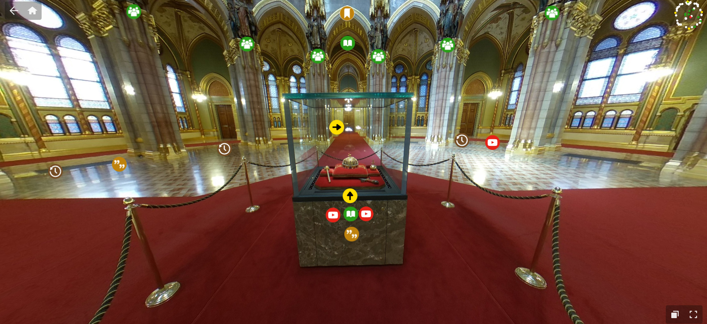
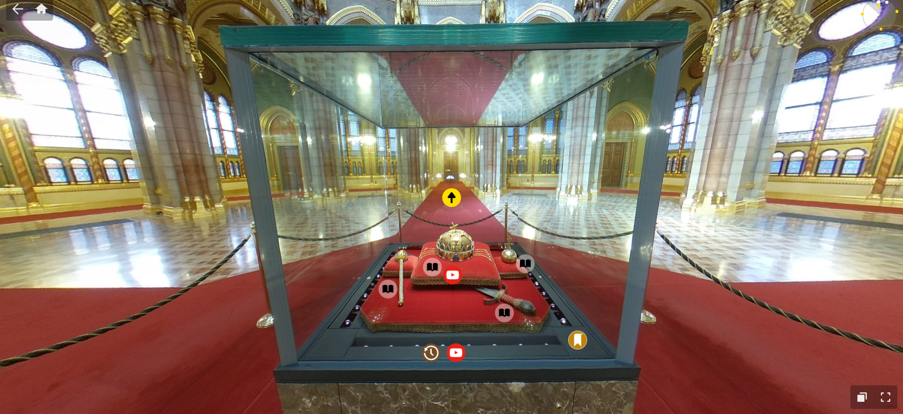
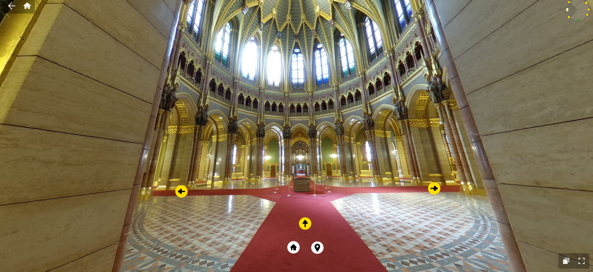
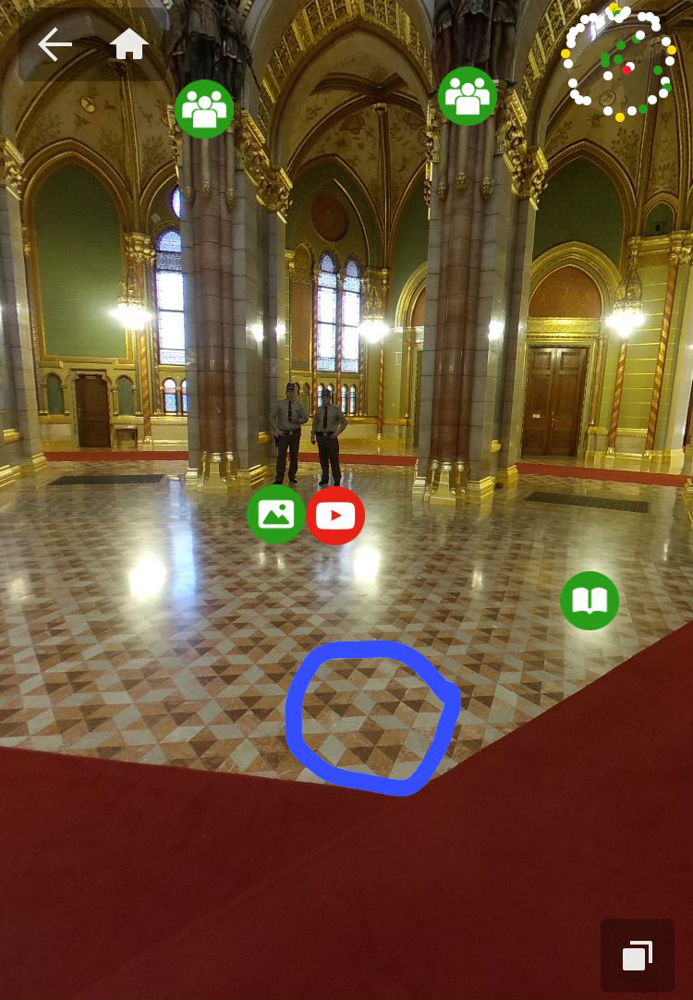
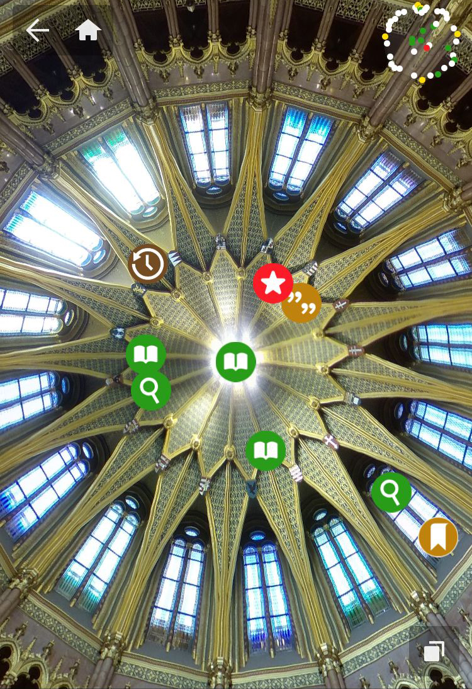
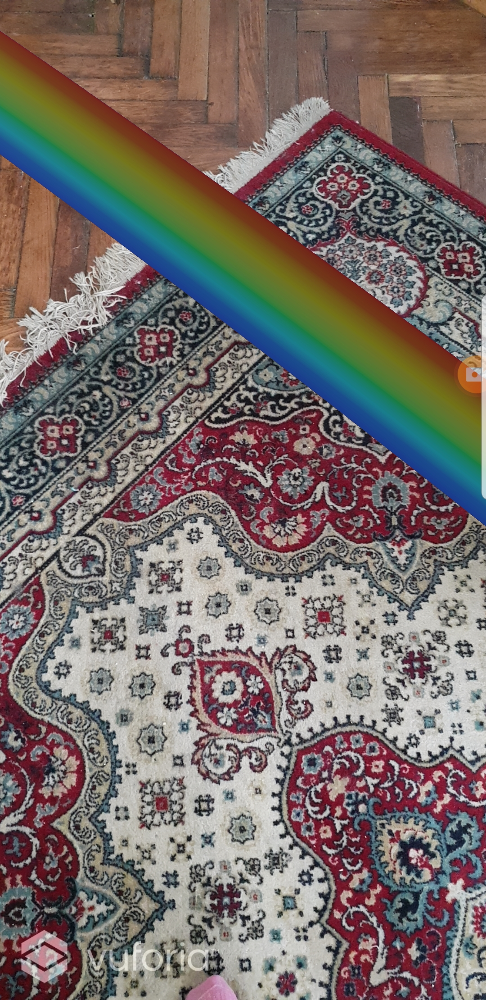
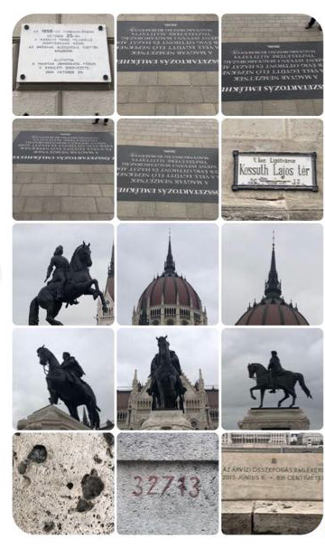

## Beginning of summer
My friend, Gábor Ott, wrote me that he has an idea to create an app which turns any flag into a rainbow flag. I liked the idea, and I asked my classmates if they would want to work on such a thing, but we were busy with 48h NK and Sehsüchte. The idea came back to me more and more often, the worse and worse news I read related to the Hungarian government's LGBTQ laws, and how it increased aggressivity towards people even just putting rainbow flags on their balcony.
With another friend we have been thinking about an AR protest group exhibition for a while, but we are talking a lot, but we enjoy laughing about things more.

It has been also a question on which platform it would be good ot make an exhibition. For a groupshow Adobe Aero would be good, because even 2d artists can easily create with it, but it's not a good platform for exhibiting. 

## 25.08.
Brainstorming with Gábor.Our idea is that it would be cool to have a marker, which can not be easily removed. I remembered my friends' AR exhibition where they used the shadow of a plant as a marker. We are thinking about that if it's just one very well placed rainbow, that's already good. We think about what can be the marker around the Parlament. We also had the idea that how cool it could be if the marker is the Holy Crown. It is in the parliament, and visitors can see it. And what could be a more powerful sign than the holy crown, the symbol of the unity of Hungary having a rainbow.

## 27.08.
Research on the crown: the history, how it looks like, which part of it could be used as a marker. Where and how is it stored. How much is to get into the Parliament.
According to the photos, the crown is behind a glass cube, which I think can be a problem for making itself as the marker, because of the reflections. Which is sad and not so elegant. So probably I'll have to find something which is close to it, maybe a description sign, and that is a part of the Parliament itself, so it can't be removed.
I also tried to look up if I can get into prison by using the crown not how it is supposed to be. I reached out to an association offering legal support and advice for people who want to practice their political free speech rights. 

## 01.09.
They answered from the legal advice association, they said it's a very interesting question. Long story short, I won't get into prison, and I'm not commiting anything illegal. In case I create an app, I have to mention all the safety cautions, like in Pokémon go, that you shouldn't drive during using the app, and pay attention to real life things happening. 

## 16.09.
looking for rainbow models. this looks kind of how i imagined it.
https://www.cgtrader.com/3d-models/exterior/landscape/rainbow-e4a36be8-1c3b-4dd2-9f4a-646784080093
looking at the space of the crown looking for things that could be markers here.
https://www.thinglink.com/mediacard/1311695728459907074

so far that i can imagine as an option: the kupola itself, the floor pattern. it would be cool if the texture of the marble holding the crown would be it, but it's not too contrasty.

I bought tickets to the parliament, unfortunately they just got more expensive. I'll have a trip on the 24th, when I make as many pictures as possibles, for having the images for markers. I'll have another trip on the 28th, when hopefully at least one of my markers will turn on, and put the rainbow in its correct place. In case something goes wrong, I can still go on the 29th or 30th. I'm a bit afraid of that I will look too suspicious, as one can enter the parliament only with 45 min long guided tours, and the crown is just one stop. In theory, I can make photos, but I'm not sure if in the quantity that I want to. 

## 19.09.
I talked with Denise about the marker question. She suggested, that I could make more photos about the crown from more angles, and add all these photos as different markers, and tell them that if one is triggered, the others shouldn't turn on. But she also thinks that the reflections of the glass might be problems. She also suggested to look into GPS based solutions, and maybe to put one rainbow above the parliament, which is also a good solution, I'm just very excited about turning a 1000 year old historical object into a marker. 

## 24.09.
I did my first field trip to the parliament. I walked around the parliament to look for possible markers for an outside rainbow. It is not allowed to go close to the building from any direction, which is weird, but maybe not a problem, as I want to make a very big rainbow outside. The designers of the square didn't think too AR marker friendly about the statues and patterns, all the statues are homogeneous. The street signs could be possible options, and also the GPS coordinates, as Denise recommended.
I also went on the guided trip inside the parliament. Very bad news is that it is not allowed to take any pictures in the space of the crown, two guys with swords are telling people not to do so. It is not fully impossible, but if I want users to use the app, it is not ideal.
In the room afterwards, there is a rug, which has a nice pattern, and if one looks back, can secretly make a photo form there. And also the windows could be good markers, they were designed my Miksa Roth, and has very nice patterns, but still. 
I was very disappointed by this fact.
I looked at the parliamental meeting room as well, where one could put a rainbow above our prime minister, and there are some details, which could be used as markers, for example there is a very pretty heating and airing system which has ornamentic lids, and this space is used more actively then the crown space, and it would be fun, if the politicians of the opposition could protest with it, at the same time, this would give an extra meaning to my project, and I prefer if it is stays neutral.

## 26.09.
I saw a funny post about the parliament and i realised, that if I want to put a rainbow over the parliament, I should go to the other side of the Danube, and not next to it. This could have been obvious, but it wasn't for me. :S
## 27.09.
I implemented the rainbow model to Unity, which I bought for 3 dollars. It was gray, and I couldn't figure out why is it gray and I could find the texture which looked any colourful. I've spent a lot of time and I got very annoyed.
I decided to make the prototype from the cloud AR project, as it is already working, I just created a new scene for the rainbow. They kind of have the same topic, so it's fair.
I chose my friend's carpet as a marker as it looks similarly detailed as in the parliament. 

## 28.09.
I've spent more time on finding what could I do wrong in putting the texture on the model. After an awkward amount of time I realised that I didn't unzip that folder of the textures, where the colourful part is. :S 
I made the rainbow colourful, but I couldn't figure out yet, where to put hte black and white transparency layer of it. The two Unity pages I've been reading didn't fully help.
I implemented it though and now it's working that when my phone sees the carpet, the rainbow appears. 
Weirdly only one side is visible. I might just put 2 rainbows next to each other facing the other directions.

## 29.09.
Another field trip, I looked for marker options at Batthyányi square, which is on the opposite side of the Danube, so the Parliament has the best iew from there and it's usually photographed from that point of view. Then I went to the Kossuth square, where this time they let average humans on the square, last time it was closed. These are the possible markers I collected today.

I've tried to make the rainbow seethrough again, I don't understand why I'm spending so much time on this. After trying things again for too long, I asked Denise, she told me how to do it in 2 sentences :S
And I worked on the documentation most of the time today.
I tried to optimize the rainbow to the parliament, as I have an appointment for tomorrow. In a smaller space than the parliament is, it is not superconvincieng what I did, but I'm hopeful. I also created a map of all the markers that I'm planning to use and I measured the distances on googlemaps.

## 30.09.
I implemented all the markers and I tried to find the right directions for the rainbows, and the right size and distance.
I gave a try everywhere, and there were things that worked surprisingly well, there were things that didn't work.
#### Markers that work well:
- the statue
- the street sign
- the memorial tablet on the wall
- the stone
- the other memorial tablet
- the carpet

#### Markers that don't work well:
- the cupola - it almost worked, the rainbow appeared when i was moving my phone, but whenever I stopped to make an image, it disappeared. I think the problem is that I zoomed in when I made the marker png, and on the vuforia app I couldn't zoom in.
- the memorial tablet on the floor - it rained today, and the material was very shiny, and started to reflect it's environment, which probably didn't help
- the number on the wall - the rain might have caused a change of the colours

As I 

